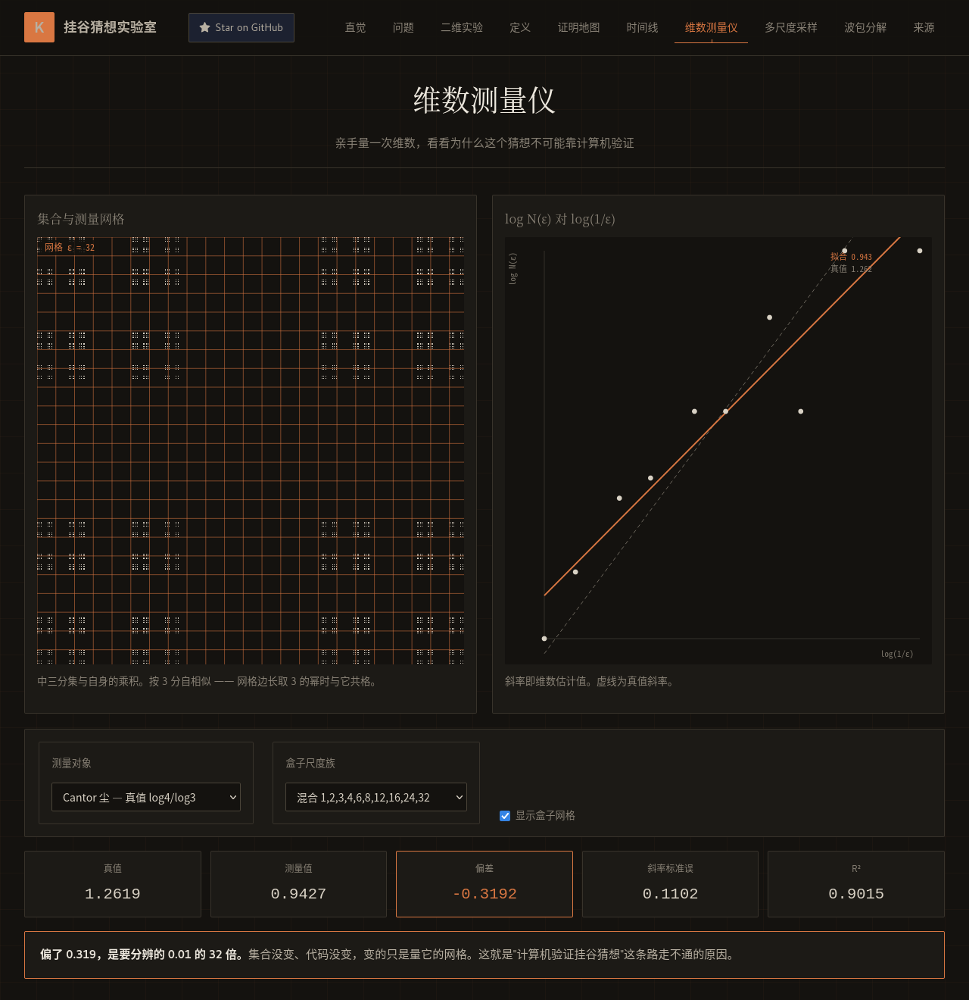

# 挂谷猜想实验室 · Kakeya Conjecture Lab

**一根单位长度的针,能否在测度为零的集合里指向所有方向?** 1917 年的一个转针问题,2026 年因它颁出一枚菲尔兹奖。

这是一个交互式科普页面:用可拖动的三维细管、二维覆盖实验和维数估计,把挂谷猜想的直觉建立起来。

<p align="center">
  
</p>

> ⚠️ **页面里的一切动画都不是证明。** 有限根线段、有限细管、像素级覆盖只能建立直觉;真正的证明在下方"来源"里。这一点写在页面首屏,也写在这里。

## 在线试玩

**https://guocheng24.github.io/kakeya-conjecture-lab/**

拖动旋转、滚轮缩放,切换四种细管排布(中心星束 / 分散排列 / 多尺度黏连 / 木纹颗粒),调整样本数 `N` 与管半径 `δ`,观察体积如何随排布变化。

## 它讲清楚了什么

**三个常被混为一谈的问题**,页面把它们分开:

| | 年份 | 问的是什么 |
|---|---|---|
| 挂谷针问题 | 1917 | 针连续转过 180° 所需的**最小面积**是多少 |
| Besicovitch 集合 | 1928 | 存在**面积为零**却含所有方向单位线段的集合 |
| 现代挂谷集合猜想 | 至今 | 这类集合的 **Hausdorff 维数是否必须等于 n** |

**猜想的现状**:三维情形由王虹与 Joshua Zahl 于 2025 年证明;**四维及以上仍然开放**。王虹因此获 2026 年菲尔兹奖(2026 年 7 月 23 日,费城,史上第三位女性得主)。

**页面覆盖的内容**:直觉 → 三个问题 → 二维覆盖实验 → 正式定义(挂谷集合 / Lebesgue 测度 / Hausdorff 维数 / Minkowski 维数)→ 证明地图(细管、粗管、黏连、木纹颗粒、尺度归纳)→ 时间线 → 维数估计 → 多尺度采样 → 波包分解 → 来源。

## 数学正确性

页面涉及的每个结论都可追溯到原始论文:

| 结论 | 出处 |
|---|---|
| 三维挂谷集合具有完整维数 | Wang & Zahl, *Volume estimates for unions of convex sets, and the Kakeya set conjecture in three dimensions*, [arXiv:2502.17655](https://arxiv.org/abs/2502.17655) |
| 黏连(sticky)情形 | Wang & Zahl, *Sticky Kakeya sets and the sticky Kakeya conjecture*, [arXiv:2210.09581](https://arxiv.org/abs/2210.09581) |
| 简化证明 | Guth, Wang & Zahl, *A streamlined proof of the Kakeya set conjecture in $\mathbb{R}^3$*, [arXiv:2601.14411](https://arxiv.org/abs/2601.14411) |
| 证明导读 | Guth, *Introduction to the proof of the Kakeya conjecture*, [arXiv:2505.07695](https://arxiv.org/abs/2505.07695) |
| 经典综述 | Wolff, *Recent work connected with the Kakeya problem*, Notices of the AMS (2000) |

上述 arXiv 编号均已逐条核验可解析。

**二维实验里的覆盖率是真实测量的**:按像素与背景色比对得出,随方向数与压缩程度变化。把方向数调到 160、压缩调到 0.15,覆盖率约 0.6% —— 比 12 个方向、不压缩时的 1.1% 还小。**方向可以更多,面积却可以更小**,这正是 Besicovitch 构造的直觉。

**页面刻意不做的事**:不宣称任何动画构成证明,不把有限样本的覆盖率当作测度,不把像素计数当作维数。维数估计模块给出的是**盒计数斜率的经验估计**,受分辨率与样本数限制——它用来培养直觉,不用来支持结论。

## 本地运行

纯静态页面,Three.js 从 CDN 加载,没有构建也能直接看:

```bash
git clone https://github.com/GuoCheng24/kakeya-conjecture-lab.git
cd kakeya-conjecture-lab
python3 -m http.server 8000     # 然后打开 http://localhost:8000
```

需要开发模式(热更新)或产出 `dist/`:

```bash
npm install
npm run dev        # vite 开发服务器
npm run build      # 产出 dist/
```

⚠️ 页面通过 CDN 加载 `three@0.160.0`。离线环境下三维部分不会渲染,二维实验不受影响。

## 参与改进

欢迎指出:

- **数学表述不准确的地方** —— 请指明是哪一句、正确表述是什么、出处;
- 可视化上看不清或有误导的地方;
- 新增可交互的直觉实验。

数学相关的改动请附出处。这个页面的价值全在于"科普但不失准"。

## 许可

代码 MIT。页面文字与图示 CC BY 4.0。引用的论文版权归原作者。
